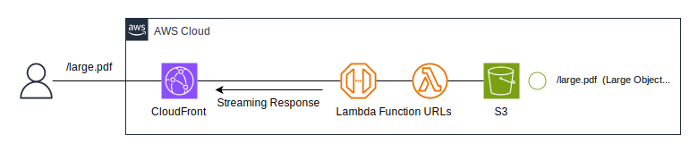

# Sample - Lambda large payload response with Streaming Response via CloudFront

This repository is a demo sample that Lambda response large payload ( > 6MB) using Lambda Streaming Response via CloudFront.

**This is not for production, use it for testing.**

[日本語の情報](https://blog.msysh.me/posts/2024/04/using-lambda-stream-response-to-response-over-6mb-via-cloudfront.html)

## Architecture

The following is an architecture deployed by CDK.



It is not practical because it only retrieves and responds to files stored in S3. This is done for simplicity.

## How to deploy

All resources for this project are provisioned by the AWS Cloud Development Kit (CDK).
If you have not installed the CDK, first install it by referring to [this document](https://docs.aws.amazon.com/cdk/v2/guide/getting_started.html).

### 1. Clone this project

```bash
git clone https://github.com/msysh/aws-sample-lambda-stream-response-via-cloudfront.git
```

### 2. Deploy AWS resources by CDK

```bash
cd aws-sample-lambda-stream-response-via-cloudfront
cdk deploy
```

After completion deployment, you can get following values and so on.
Please note them.

* CloudFront Distribution URL (`OutputCloudFrontDistributionUrl`)
* S3 Bucket name (`OutputS3BucketName`)

### 3. Upload a large file to S3

Upload a large file (> 6MB) to S3 for Lambda Streaming Response.

```bash
aws s3 cp large.pdf s3://${BUCKET_NAME}/
```

_`${BUCKET_NAME}` is able to get as `OutputS3BucketName` from CDK Output._

### 4. Request to Lambda Function URL via CloudFront

Request to Lambda Function URL via CloudFront

```bash
curl -v https://${CLOUDFRONT_DOMAIN_NAME}/large.pdf
```

_`https://${CLOUDFRONT_DOMAIN_NAME}` is able to get as `OutputCloudFrontDistributionUrl` from CDK Output._

You should get the following output:

```
*   (snip)
> GET /large.pdf HTTP/2
> Host: dXXXXXXXXXXXXX.cloudfront.net
> User-Agent: curl/8.4.0
> Accept: */*
>
< HTTP/2 200
< content-type: application/pdf
<   (snip)
{ [15922 bytes data]
```

You can see that the response is returned in streaming mode.

If you request with `--http1.1`, the HTTP response header will be set to `Transfer-Encoding: chunked`

```
>   (snip)
> GET /large.pdf HTTP/1.1
> Host: dXXXXXXXXXXXXX.cloudfront.net
> User-Agent: curl/8.4.0
> Accept: */*
>
< Content-Type: application/pdf
< Transfer-Encoding: chunked
< Connection: keep-alive
<   (snip)
  0     0    0     0    0     0      0      0 --:--:--  0:00:02 --:--:--     0{ [16384 bytes data]
100 6858k    0 6858k    0     0  1352k      0 --:--:--  0:00:05 --:--:-- 1792k
```

## Clean up

Remove resources by CDK.

```bash
cdk destroy
```

## License

MIT
